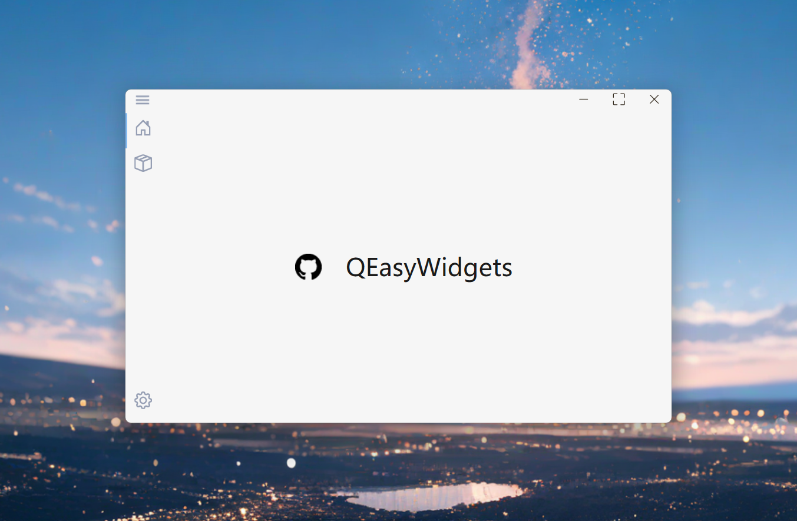

<div align = "center">

# QEasyWidgets

A simple Qt widget library.
The python version is based on PySide6.

[](https://pypi.org/project/QEasyWidgets/)&nbsp;

[**简体中文**](./docs/README_CN.md) | **English**



</div>


## Deployment

### pip

```shell
pip install QEasyWidgets -i https://pypi.org/simple/
```


## Cases
Here are some projects based on QEasyWidgets:
- [Easy Voice Toolkit](https://github.com/Spr-Aachen/Easy-Voice-Toolkit)
- [LLM PromptMaster](https://github.com/Spr-Aachen/LLM-PromptMaster)
- [ParkingLot-Management](https://github.com/Spr-Aachen/ParkingLot-Management)


## Reference
- [Microsoft WinUI-Gallery](https://github.com/microsoft/WinUI-Gallery)
- [PyEasyUtils](https://github.com/Spr-Aachen/PyEasyUtils)